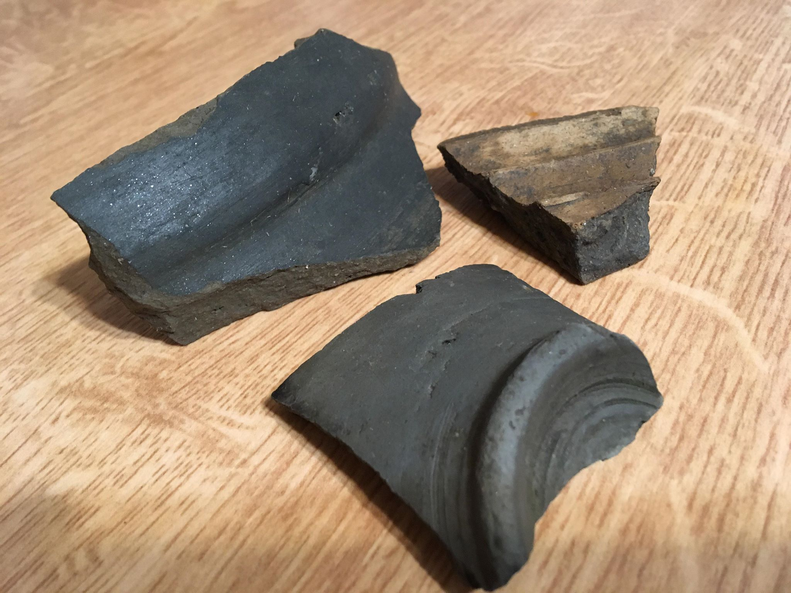

# cronica-arheologica

Acesta este API-ul destinat agregării datelor privind cronicile arheologice.

Pentru a instala aplicația următoarele componente trebuie să existe deja instalate pe sistemul server:

- Node.js și npm
- MongoDB,
- Postman (pentru a interoga și scrie date).

Pasul 1:
Din linia de comandă: `$ npm install` pentru a instala toate dependințele

Pasul 2:
Din linia de comandă pornește execuția aplicației: `$ npm start`

Pasul 3:
Folosește Postman pentru a testa căile. Descarcă Postman de la https://www.getpostman.com/

## GET localhost:8000/cronicile

Setează în Postman o rută de GET direct pe calea `cronicile`. Răspunsul este un json dacă ai date în bază

## GET localhost:8000/cronicile/idulCunoscutAlUneiÎnregistrari

Setează în Postman o rută GET pe calea `cronicile`. Răspunsul este un json pentru o înregistrare unică cunoscută.

## POST localhost:8000/cronicile

Setează în Postman o rută POST prin care să introduci înregistrări în bază.
Body setează-l la raw cu opțiunea JSON(application/JSON). Întrodu obiectul JSON și Send.

## PATCH localhost:8000/cronicile/idulCunoscutAlUneiÎnregistrari

ody setează-l la raw cu opțiunea JSON(application/JSON). Întrodu obiectul JSON care actualizează câmpurile dorite și Send.